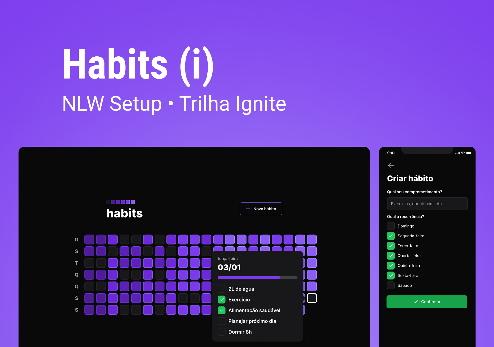

# Habits • Rastreador de hábitos `<NLW Setup/>`



## Índice

- [Sobre](#sobre)
- [Referência da API](#referência-da-api)
- [Contribuição](#contribuição)
- [Licença](#licença)

## Sobre

**Habits** é um aplicativo projetado para ajudar você a rastrear seus hábitos e melhorar sua qualidade de vida. Com ele, você pode criar uma lista de hábitos que deseja incorporar em sua rotina diária e marcá-los a medida que os pratica.

O aplicativo apresenta um quadro diário que mostra a frequência dos hábitos praticados, permitindo que você veja sua progresso ao longo do tempo e se motive a seguir em frente.

---

## Referência da API

**Obter o resumo dos hábitos**

```bash
GET /summary
```

**Obter os hábitos possíveis referente a uma data**

```bash
GET /day?{date}
```

| Parâmetro | Tipo     | Descrição                   |
| :-------- | :------- | :-------------------------- |
| `date`    | `string` | Data dos possíveis hábitos. |

**Alternar o estado de um hábito específico**

```bash
PATCH /habits/{id}/toggle
```

| Parâmetro | Tipo     | Descrição                             |
| :-------- | :------- | :------------------------------------ |
| `id`      | `string` | Id do hábito a ter o estado alternado |

**Criar um hábito**

```bash
POST /habits
```

Corpo em `JSON`

```js
{
  "title": "Beber 2L de água",
  "weekDays": [0, 2, 4, 6]
}
```

| Chave      | Tipo     | Descrição                                   |
| :--------- | :------- | :------------------------------------------ |
| `title`    | `string` | Título do hábito a ser criado               |
| `weekDays` | `array`  | Array numérico referente aos dias da semana |

## Contribuição

Contribuições são sempre bem-vindas! Se você tem alguma ideia para melhorar o projeto, por favor, abra uma issue ou envie um pull request.

## Licença

Este projeto está licenciado sob a licença **MIT**. Por favor, leia o arquivo [LICENSE.md](./LICENSE.md) para mais informações.
